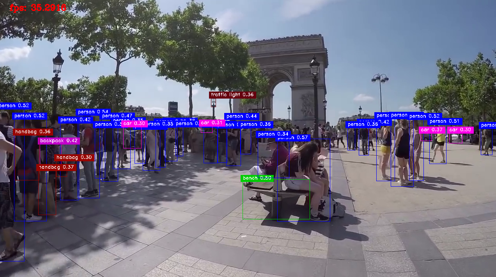
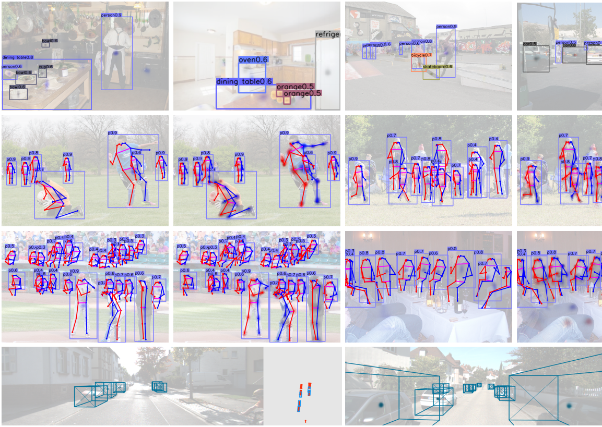
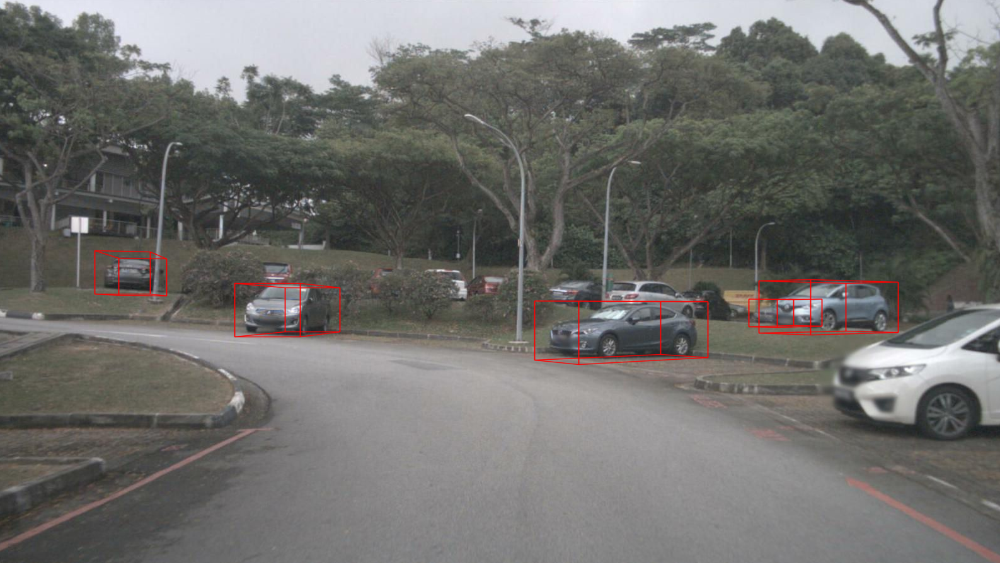

# CenterNet

this is a version support pytorch 1.0, original implementation is [here](https://github.com/xingyizhou/CenterNet).
**centernet** is the very first method that combines all computer vision task togather within one single solution. it can do almost all computer vision task at the same time:

**this branch will try lighten CenterNet and export to onnx and finally deploy model with TensorRT**.

- detection
- pose estimation
- 3D object detection

**news:** We have add onnx export support and TensorRT conversion inside this repo. Feel free to run the 80fps high accuracy detector!

Here is a look at what it capable of:







## Pretrained Models

We prepared some pretrained models. For now, support 3D detect trained on kitti, and multi pose and
detect trained on coco:

- [ddd_3d](https://pan.baidu.com/s/10t89P-mjXZ8r2XlMGC8m_Q): password:  9x2b ;
- [multi_pose](https://pan.baidu.com/s/1YyGwjrR6L1zkr9jXh9Tumg): password: i8wu;
- [centernet_resnet101_coco.onnx](https://drive.google.com/open?id=17Vv90yFKgzH64xE5y60V3hmyegX2zSTr)
- ctdet_r101_coco.pth: https://www.mediafire.com/file/loc5ez17s7dwsu5/ctdet_coco_r101.pth/file

## 


## Run

make sure you have those requirements:

```
pytorch 1.0
python3

sudo pip3 install alfred-py
sudo pip3 install absl-py
```

to run a demo, simply:

```
# build DLA extension first
./make.sh

# change video path inside demo_det.sh
./demo_det.sh path/to/video.mp4
```

then it will do inference on video.
Here is a result on 3D object detection on single image:


## Export to ONNX

**note**, due to we have to change model to support onnx export, you should manually change this file:

```
models/networks/pose_dla_dcn.py
```

inside line number 438:
```
        self.onnx_mode = False

```

change this to True, and it will support export resnet101 model to onnx.
**update**: For export CenterNet Resnet101 to ONNX, there is no need to do that. You can directly using `export_det_r101_onnx.py`.


## Train

Training instructions:

- **A. Training a Detection model.**

    To train a detection model, we encourage uses training start with coco. Once you successfully training on coco, you can train it on any other dataset.

    ```
    ./train_coco_r101.sh
    ```

    this will start training resnet101 model. You should also soft link your coco root under `data`.

- **B. Training a Pose estimation model.**

    To train pose estimation model, using coco keypoints dataset.

- **C. Training a 3D detection model.**

    We have successfully trained on KITTI, so you can start with kitti. Follow those steps you can train on kitti:

    ```
    # copy ImageSets_subcnn to your kitti root 
    # frist converts KITTI format data into coco format (using JSON as annotations)
    python3 tools/convert_kitti_to_coco.py
    # if you want try nuScenes (more complicated), you can also change nuScenes to KITTI first
    python3 tools/convert_nuscenes_to_coco.py
    # you will found annotations inside KITTI root, link it to current data path, my case:
    ln -s /media/jintain/sg1/permanent/datasets/KITTI/object/ ./data/kitti
    # then start to train
    ./train_kitti.sh
    ```

    the annotations converts to coco like this:
    ```json
    {
        "annotations": [{"image_id": 0, "id": 1, "category_id": 1, "dim": [1.89, 0.48, 1.2], "bbox": [712.4, 143.0, 98.33000000000004, 164.92000000000002], "depth": 8.41, "alpha": -0.2, "truncated": 0, "occluded": 0, "location": [1.84, 1.47, 8.41], "rotation_y": 0.01}
    }
    ```
    here is a data preparing screenshot, as you can see, nuScenes does not apply rectorfication and result seems not accurate:
    


to train CenterNet on custom datasets. simple write a dataset like coco.
We also tried to train on nuScences data, will update this repo after we trained it success.
