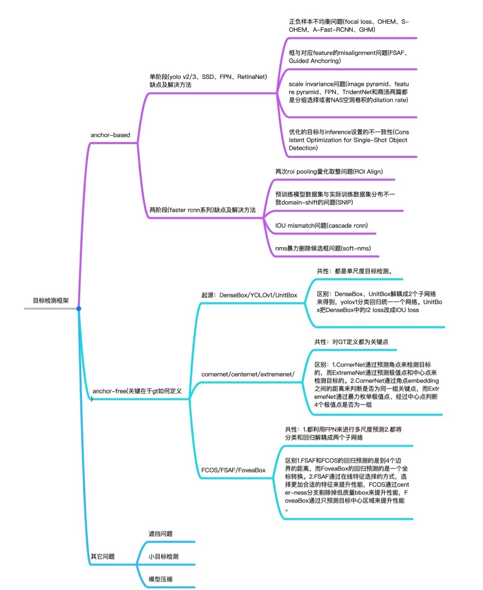

# ObjectDetection
some object detection algo

## Paper list from 2014 to now(2019)
The part highlighted with red characters means papers that i think "must-read".
However, it is **my personal opinion** and other papers are important too, so I recommend to read them if you have time.

##

## Performance table

FPS(Speed) index is related to the hardware spec(e.g. CPU, GPU, RAM, etc), so it is hard to make an equal comparison. The solution is to measure the performance of all models on hardware with equivalent specifications, but it is very difficult and time consuming. 

|   Detector   | VOC07 (mAP@IoU=0.5) | VOC12 (mAP@IoU=0.5) | COCO (mAP@IoU=0.5:0.95) | Published In |
|:------------:|:-------------------:|:-------------------:|:----------:|:------------:| 
|     R-CNN    |         58.5        |          -          |      -     |    CVPR'14   |
|    SPP-Net   |         59.2        |          -          |      -     |    ECCV'14   |
|    MR-CNN    |     78.2 (07+12)    |     73.9 (07+12)    |      -     |    ICCV'15   |
|  Fast R-CNN  |     70.0 (07+12)    |     68.4 (07++12)   |    19.7    |    ICCV'15   |
| Faster R-CNN |     73.2 (07+12)    |     70.4 (07++12)   |    21.9    |    NIPS'15   |
|    YOLO v1   |     66.4 (07+12)    |     57.9 (07++12)   |      -     |    CVPR'16   |
|     G-CNN    |         66.8        |     66.4 (07+12)    |      -     |    CVPR'16   |
|     AZNet    |         70.4        |          -          |    22.3    |    CVPR'16   |
|      ION     |         80.1        |         77.9        |    33.1    |    CVPR'16   |
|   HyperNet   |     76.3 (07+12)    |    71.4 (07++12)    |      -     |    CVPR'16   |
|     OHEM     |     78.9 (07+12)    |    76.3 (07++12)    |    22.4    |    CVPR'16   |
|      MPN     |           -         |          -          |    33.2    |    BMVC'16   |
|      SSD     |     76.8 (07+12)    |    74.9 (07++12)    |    31.2    |    ECCV'16   |
|    GBDNet    |     77.2 (07+12)    |          -          |    27.0    |    ECCV'16   |
|      CPF     |     76.4 (07+12)    |    72.6 (07++12)    |      -     |    ECCV'16   |
|     R-FCN    |     79.5 (07+12)    |    77.6 (07++12)    |    29.9    |    NIPS'16   |
|  DeepID-Net  |         69.0        |          -          |      -     |    PAMI'16   |
|      NoC     |     71.6 (07+12)    |    68.8 (07+12)     |    27.2    |   TPAMI'16   |
|     DSSD     |     81.5 (07+12)    |    80.0 (07++12)    |    33.2    |   arXiv'17   |
|      TDM     |          -          |          -          |    37.3    |    CVPR'17   |
|      FPN     |          -          |          -          |    36.2    |    CVPR'17   |
|    YOLO v2   |     78.6 (07+12)    |    73.4 (07++12)    |      -     |    CVPR'17   |
|      RON     |     77.6 (07+12)    |    75.4 (07++12)    |    27.4    |    CVPR'17   |
|     DeNet    |     77.1 (07+12)    |    73.9 (07++12)    |    33.8    |    ICCV'17   |
|   CoupleNet  |     82.7 (07+12)    |    80.4 (07++12)    |    34.4    |    ICCV'17   |
|   RetinaNet  |          -          |          -          |    39.1    |    ICCV'17   |
|     DSOD     |     77.7 (07+12)    |    76.3 (07++12)    |      -     |    ICCV'17   |
|      SMN     |         70.0        |          -          |      -     |    ICCV'17   |
|Light-Head R-CNN|        -          |          -          |    41.5    |   arXiv'17   |
|    YOLO v3   |          -          |          -          |    33.0    |   arXiv'18   |
|      SIN     |     76.0 (07+12)    |    73.1 (07++12)    |    23.2    |    CVPR'18   |
|     STDN     |     80.9 (07+12)    |          -          |      -     |    CVPR'18   |
|   RefineDet  |     83.8 (07+12)    |    83.5 (07++12)    |    41.8    |    CVPR'18   |
|     SNIP     |          -          |          -          |    45.7    |    CVPR'18   |
|Relation-Network|        -          |          -          |     32.5   |    CVPR'18   |
| Cascade R-CNN|          -          |          -          |     42.8   |    CVPR'18   |
|     MLKP     |     80.6 (07+12)    |    77.2 (07++12)    |     28.6   |    CVPR'18   |
|  Fitness-NMS |          -          |          -          |     41.8   |    CVPR'18   |
|    RFBNet    |     82.2 (07+12)    |          -          |      -     |    ECCV'18   |
|   CornerNet  |          -          |          -          |     42.1   |    ECCV'18   |
|    PFPNet    |     84.1 (07+12)    |    83.7 (07++12)    |     39.4   |    ECCV'18   |
|    Pelee     |     70.9 (07+12)    |          -          |      -     |    NIPS'18   |
|     HKRM     |     78.8 (07+12)    |          -          |     37.8   |    NIPS'18   |
|     M2Det    |          -          |          -          |     44.2   |    AAAI'19   |
|     R-DAD    |     81.2 (07++12)   |    82.0 (07++12)    |     43.1   |    AAAI'19   |
| ScratchDet   |   84.1 (07++12)     |    83.6 (07++12)    |     39.1   |    CVPR'19   |
| Libra R-CNN  |          -          |          -          |     43.0   |    CVPR'19   |
| Reasoning-RCNN  | 82.5 (07++12)    |          -          |     43.2   |    CVPR'19   |
|      FSAF    |          -          |          -          |     44.6   |    CVPR'19   |
| AmoebaNet + NAS-FPN |     -        |          -          |     47.0   |    CVPR'19   |
| Cascade-RetinaNet |       -        |           -         |     41.1   |    CVPR'19   |
|   TridentNet |          -          |          -          |     48.4   |    ICCV'19   |
|      DAFS    |   **85.3 (07+12)**  |    83.1 (07++12)    |     40.5   |    ICCV'19   |
|   Auto-FPN   |     81.8 (07++12)   |          -          |     40.5   |    ICCV'19   |
|     FCOS     |          -          |          -          |     44.7   |    ICCV'19   |
|   FreeAnchor |          -          |          -          |     44.8   |  NeurIPS'19  |
|    DetNAS    |     81.5 (07++12)   |          -          |     42.0   |  NeurIPS'19  |
|     NATS     |          -          |          -          |     42.0   |  NeurIPS'19  |
| AmoebaNet + NAS-FPN + AA |   -     |          -          |     50.7   |    arXiv'19  |
| EfficientDet |          -          |          -          |   **51.0** |    arXiv'19  |

##

##

## Dataset Papers
Statistics of commonly used object detection datasets. The Table came from [this survey paper](https://arxiv.org/pdf/1809.02165v1.pdf).

<table>
<thead>
  <tr>
    <th rowspan=2>Challenge</th>
    <th rowspan=2 width=80>Object Classes</th>
    <th colspan=3>Number of Images</th>
    <th colspan=2>Number of Annotated Images</th>
  </tr>
  <tr>
    <th>Train</th>
    <th>Val</th>
    <th>Test</th>
    <th>Train</th>
    <th>Val</th>
  </tr>
</thead>
<tbody>

<!-- PASCAL VOC Object Detection Challenge -->
<tr><th colspan=7>PASCAL VOC Object Detection Challenge</th></tr>
<tr><td> VOC07 </td><td> 20 </td><td> 2,501 </td><td> 2,510 </td><td>  4,952 </td><td>   6,301 (7,844) </td><td>   6,307 (7,818) </td></tr>
<tr><td> VOC08 </td><td> 20 </td><td> 2,111 </td><td> 2,221 </td><td>  4,133 </td><td>   5,082 (6,337) </td><td>   5,281 (6,347) </td></tr>
<tr><td> VOC09 </td><td> 20 </td><td> 3,473 </td><td> 3,581 </td><td>  6,650 </td><td>   8,505 (9,760) </td><td>   8,713 (9,779) </td></tr>
<tr><td> VOC10 </td><td> 20 </td><td> 4,998 </td><td> 5,105 </td><td>  9,637 </td><td> 11,577 (13,339) </td><td> 11,797 (13,352) </td></tr>
<tr><td> VOC11 </td><td> 20 </td><td> 5,717 </td><td> 5,823 </td><td> 10,994 </td><td> 13,609 (15,774) </td><td> 13,841 (15,787) </td></tr>
<tr><td> VOC12 </td><td> 20 </td><td> 5,717 </td><td> 5,823 </td><td> 10,991 </td><td> 13,609 (15,774) </td><td> 13,841 (15,787) </td></tr>

<!-- ILSVRC Object Detection Challenge -->
<tr><th colspan=7>ILSVRC Object Detection Challenge</th></tr>
<tr><td> ILSVRC13 </td><td> 200 </td><td> 395,909 </td><td> 20,121 </td><td> 40,152 </td><td> 345,854 </td><td> 55,502 </td></tr>
<tr><td> ILSVRC14 </td><td> 200 </td><td> 456,567 </td><td> 20,121 </td><td> 40,152 </td><td> 478,807 </td><td> 55,502 </td></tr>
<tr><td> ILSVRC15 </td><td> 200 </td><td> 456,567 </td><td> 20,121 </td><td> 51,294 </td><td> 478,807 </td><td> 55,502 </td></tr>
<tr><td> ILSVRC16 </td><td> 200 </td><td> 456,567 </td><td> 20,121 </td><td> 60,000 </td><td> 478,807 </td><td> 55,502 </td></tr>
<tr><td> ILSVRC17 </td><td> 200 </td><td> 456,567 </td><td> 20,121 </td><td> 65,500 </td><td> 478,807 </td><td> 55,502 </td></tr>

<!-- MS COCO Object Detection Challenge -->
<tr><th colspan=7>MS COCO Object Detection Challenge</th></tr>
<tr><td> MS COCO15 </td><td> 80 </td><td>  82,783 </td><td> 40,504 </td><td> 81,434 </td><td> 604,907 </td><td> 291,875 </td></tr>
<tr><td> MS COCO16 </td><td> 80 </td><td>  82,783 </td><td> 40,504 </td><td> 81,434 </td><td> 604,907 </td><td> 291,875 </td></tr>
<tr><td> MS COCO17 </td><td> 80 </td><td> 118,287 </td><td>  5,000 </td><td> 40,670 </td><td> 860,001 </td><td>  36,781 </td></tr>
<tr><td> MS COCO18 </td><td> 80 </td><td> 118,287 </td><td>  5,000 </td><td> 40,670 </td><td> 860,001 </td><td>  36,781 </td></tr>

<!-- Open Images Object Detection Challenge -->
<tr><th colspan=7>Open Images Object Detection Challenge</th></tr>
<tr><td> OID18 </td><td> 500 </td><td> 1,743,042 </td><td> 41,620 </td><td> 125,436 </td><td> 12,195,144 </td><td> ― </td></tr>

  </tbody>
</table>

The papers related to datasets used mainly in Object Detection are as follows.

- **[PASCAL VOC]** The PASCAL Visual Object Classes (VOC) Challenge | **[IJCV' 10]** | [`[pdf]`](http://host.robots.ox.ac.uk/pascal/VOC/pubs/everingham10.pdf)

- **[PASCAL VOC]** The PASCAL Visual Object Classes Challenge: A Retrospective | **[IJCV' 15]** | [`[pdf]`](http://host.robots.ox.ac.uk/pascal/VOC/pubs/everingham15.pdf) | [`[link]`](http://host.robots.ox.ac.uk/pascal/VOC/)

- **[ImageNet]** ImageNet: A Large-Scale Hierarchical Image Database| **[CVPR' 09]** | [`[pdf]`](http://www.image-net.org/papers/imagenet_cvpr09.pdf)

- **[ImageNet]** ImageNet Large Scale Visual Recognition Challenge | **[IJCV' 15]** | [`[pdf]`](https://arxiv.org/pdf/1409.0575.pdf) | [`[link]`](http://www.image-net.org/challenges/LSVRC/)

- **[COCO]** Microsoft COCO: Common Objects in Context | **[ECCV' 14]** | [`[pdf]`](https://arxiv.org/pdf/1405.0312.pdf) | [`[link]`](http://cocodataset.org/)

- **[Open Images]** The Open Images Dataset V4: Unified image classification, object detection, and visual relationship detection at scale | **[arXiv' 18]** | [`[pdf]`](https://arxiv.org/pdf/1811.00982v1.pdf) | [`[link]`](https://storage.googleapis.com/openimages/web/index.html)

- **[DOTA]** DOTA: A Large-scale Dataset for Object Detection in Aerial Images | **[CVPR' 18]** | [`[pdf]`](https://arxiv.org/pdf/1711.10398v3.pdf) | [`[link]`](https://captain-whu.github.io/DOTA/)

- **[Objects365]** Objects365: A Large-Scale, High-Quality Dataset for Object Detection	| **[ICCV' 19]** | [`[link]`](https://www.biendata.com/competition/objects365/)

## YOLO series
[yolo](./YOLO/readme.md)

## SSD series
[SSD](./SSD/readme.md)

## AnchorFree series
[AnchorFree](./AnchorFree/readme.md)

## some losses
[loss](./loss/readme.md)

## some tricks
[tricks](./tricks/readme.md)

## Reference
[deep_learning_object_detection](https://github.com/hoya012/deep_learning_object_detection) 