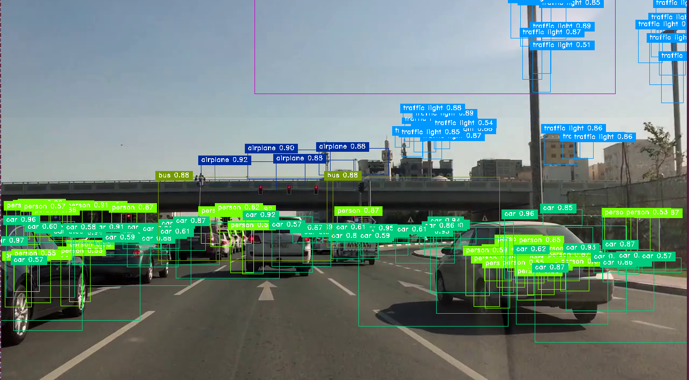
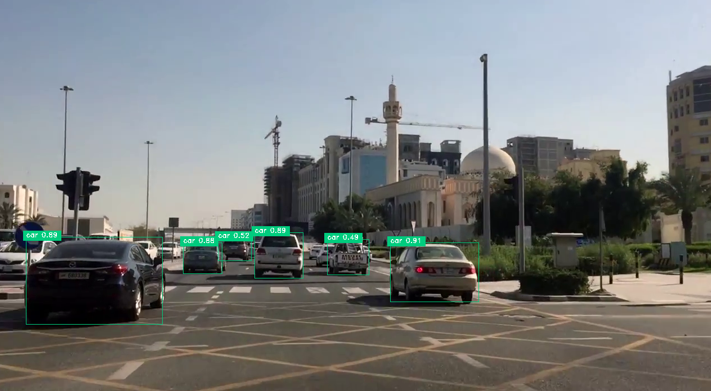
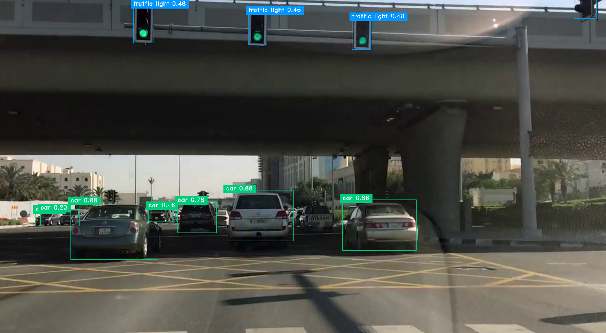

# M2Det

AAAI 2019 detection methods. this repo will merged into our new project: *advanced_onestage_detectors*  in the future. Compare to the original codes, we make some changes and improvements:

- We changed the iteration methods in caffe-like to epoch which is pytorch-like;
- We changed the learning rate adjust strategy;
- We trained the VGG16 and ResNet50 and SE ResNeXt-50 based model and compares the result;


*note*:  those advanced_onestage_detectors such as **RFBNet, Pelee, M2Det, RefineDet** will combined into single one framework, we are doing this work right now. (we will not support SSD or other SSD variants since they are out of date.)


## Install

some requirements:

```
sudo pip3 install alfred-py
./make.sh
```


## Pretrained Model

This implementation is almost same with original author. But we did lots of modifications and make the performance much more better. If you were block in China you can not access to the pretrained model. We supply 2 models which we have been trained and shared it on Baidu Disk:

- [vgg_reduced_fc](https://pan.baidu.com/s/1gyrYWtFdZgHeK7AJdX-aug) 提取码: ryxd;
- m2det_vgg_512_coco (this model is visible for MANA VIPS only. if you were MANA VIP you will see download link from above)


## Train

train m2det512 with VGG, the progress:

epoch 3:



epoch 11:



epoch 14:




## Inference

Directly predicting on `demo_webcam.py`. to see the final result.


