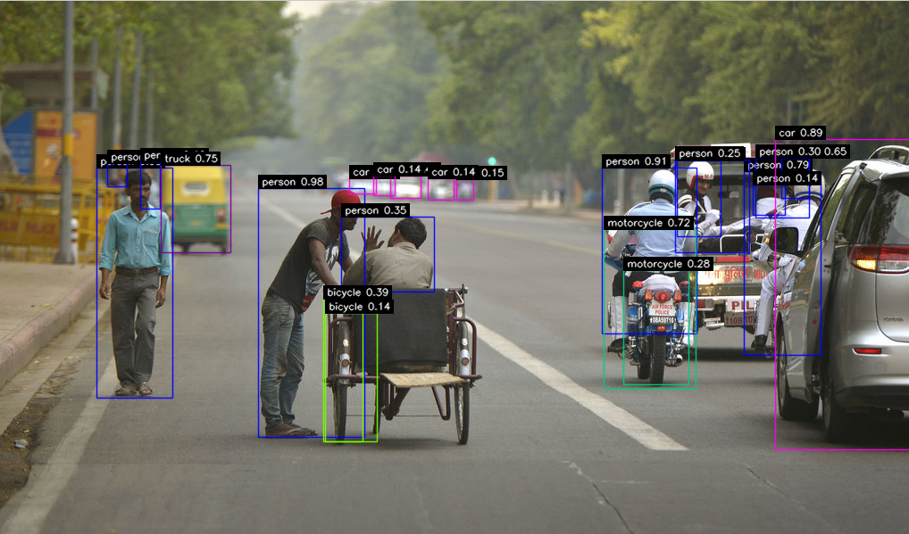
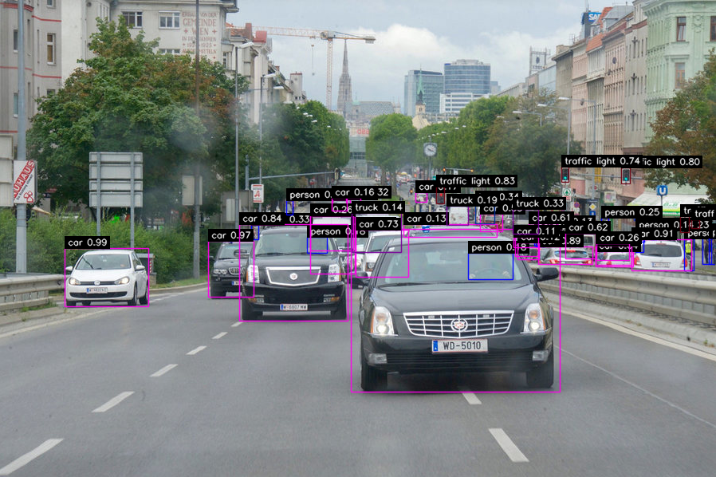

# YoloV3 ASFF

增加ASFF模块的YoloV3，相较于原始版本YoloV3，检测的mAP可以达到48.9！并且速度在GPU下也可以达到30ms。本版本在原来的基础上增加了：

- [x] onnx导出支持；
- [x] 84行代码的超简单推理脚本;
- [ ] TensorRT的onnx加速；
- [ ] ncnn的onnx前向推理；


| System                                                       | *test-dev mAP* | **Time** (V100) | **Time** (2080ti) |
| ------------------------------------------------------------ | -------------- | --------------- | ----------------- |
| [YOLOv3 608](http://pjreddie.com/darknet/yolo/)              | 33.0           | 20ms            | 26ms              |
| YOLOv3 608+ [BoFs](https://arxiv.org/abs/1902.04103)         | 37.0           | 20ms            | 26ms              |
| YOLOv3 608 (our baseline)                                    | **38.8**       | 20ms            | 26ms              |
| YOLOv3 608+ ASFF                                             | **40.6**       | 22ms            | 30ms              |
| YOLOv3 608+ ASFF*                                            | **42.4**       | 22ms            | 30ms              |
| YOLOv3 800+ ASFF*                                            | **43.9**       | 34ms            | 38ms              |
| YOLOv3 MobileNetV1 416 + [BoFs](https://arxiv.org/abs/1902.04103) | 28.6           | -               | 22 ms             |
| YOLOv3 MobileNetV2 416 (our baseline)                        | 29.0           | -               | 22 ms             |
| YOLOv3 MobileNetV2 416 +ASFF                                 | **30.6**       | -               | 24 ms             |






## Demo

要启动本项目，简单地：

```
./make.sh
python3 demo_yolov3_asff.py
```

当然，你需要下载对应的模型(默认下载asff800）。

- yolov3 mobilenetv2 (ours)[weights](https://drive.google.com/open?id=1XGXJPXHIroimEuW8oujbInNapuEDALOB) [baiduYun](https://pan.baidu.com/s/100TivomBLDTRZSA1pkGiNA) [training tfboard log](https://pan.baidu.com/s/1P_00LAUvV-VOzxqoIxC_Yw)
- yolov3 mobilenetv2 +asff [weights](https://drive.google.com/open?id=1cC-xGoaw3Wu5hYd3iXEq6xrAn4U_dW-w) [baiduYun](https://pan.baidu.com/s/1JxX8mYkljk1ap2s4zpLrSg) [training tfboard log](https://pan.baidu.com/s/1R2YL9uZ9baQWR6aht0qVlQ)
- yolov3_baseline (ours) [weights](https://drive.google.com/open?id=1RbjUQbNxl4cEbk-6jFkFnOHRukJY5EQk) [baiduYun](https://pan.baidu.com/s/131JhlaOBbeL9l4tqiJO9yA) [training tfboard log](https://pan.baidu.com/s/1GcpVnq7mhIsrk8zrJ9FF2g)
- yolov3_asff [weights](https://drive.google.com/open?id=1Dyf8ZEga_VT2O3_c5nrFJA5uON1aSJK-) [baiduYun](https://pan.baidu.com/s/1a-eQZ0kDpsnUooD4RtRdxg) [training tfboard log](https://pan.baidu.com/s/1MeMkAWwv1SFsVbvsTpj_xQ)
- yolov3_asff* (320-608) [weights](https://drive.google.com/open?id=1N668Za8OBbJbUStYde0ml9SZdM7tabXy) [baiduYun](https://pan.baidu.com/s/1d9hOQBj20HCy51qWbonxMQ)
- yolov3_asff* (480-800) [weights](https://drive.google.com/open?id=18N4_nNVqYbjawerEHQnwJGPcRvcLOe06) [baiduYun](https://pan.baidu.com/s/1HERhiP4vmUekxxm5KQrX8g)


## Train

训练模型需要将coco或者voc的对应root软连接到data下。

- 训练Darknet53的后端，需要下载与训练模型从这里 [Darknet-53](https://arxiv.org/abs/1902.04103) PyTorch base network weights at: <https://drive.google.com/open?id=1phqyYhV1K9KZLQZH1kENTAPprLBmymfP>
  or [BaiduYun Driver](https://pan.baidu.com/s/19PaXl6p9vXHG2ZuGqtfLOg)

- 训练 MobileNetV2后端的模型, we use the pytorch official [weights](https://drive.google.com/open?id=1LwMd9lK6YqGM8Yjf_ClBT2MG1-PHgUGa) (change the key name to fit our code), or from our [BaiduYun Driver](https://pan.baidu.com/s/12eScI6YNBvkVX0286cMEZA)

  ​

```
python3 -m torch.distributed.launch --nproc_per_node=10 --master_port=${RANDOM+10000} main.py \
--cfg config/yolov3_baseline.cfg -d COCO --tfboard --distributed --ngpu 10 \
--checkpoint weights/darknet53_feature_mx.pth --start_epoch 0 --half --log_dir log/COCO -s 608 
```


```
@article{liu2019asff,
    title = {Learning Spatial Fusion for Single-Shot Object Detection},
    author = {Songtao Liu, Di Huang and Yunhong Wang},
    booktitle = {arxiv preprint arXiv:1911.09516},
    year = {2019}
}
```

