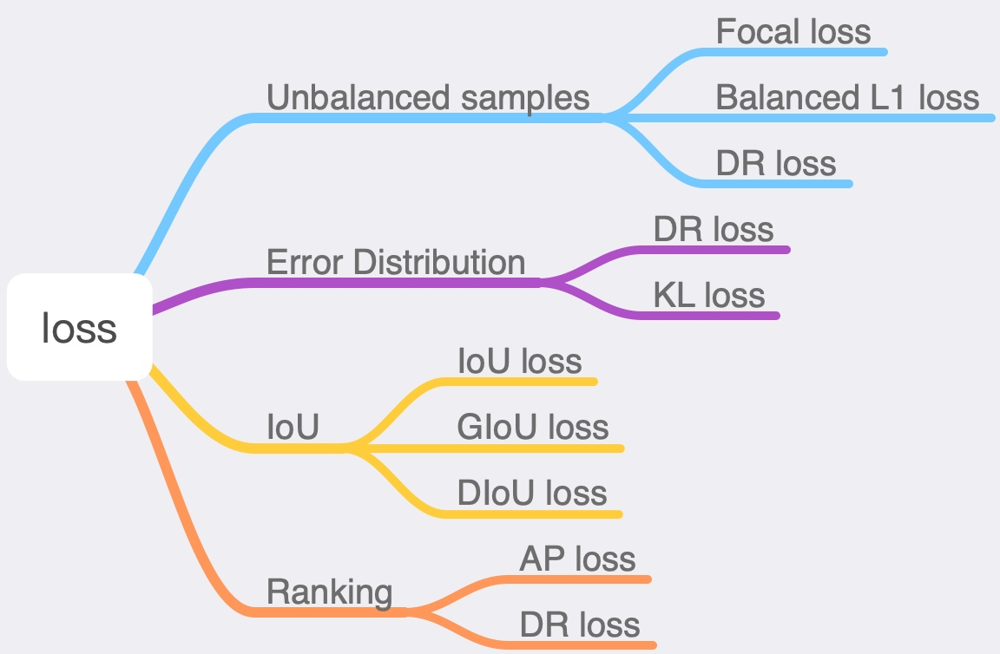

## DIoU
https://github.com/Zzh-tju/DIoU    
## KLloss
https://github.com/yihui-he/KL-Loss    
## Focal-Loss
https://github.com/hedgefair/Focal-Loss-Pytorch    
## AP-loss
https://github.com/cccorn/AP-loss    
## GHM_Loss
https://github.com/ForrestPi/GHM_Loss    
## AnchorLoss
https://github.com/slryou41/AnchorLoss    
## SCELoss
https://github.com/HanxunHuangLemonBear/SCELoss-Reproduce    

loss上的改进，大部分的思路，是找出那些原本的loss（包括regression和classification）可能会不合理的情况，修正这些不合理。总的来说，有用ranking来解决正负样本不平衡的问题（如DR loss、AP-loss，一个从分布角度，一个从AP角度）；有考虑当前的Smooth L1 Loss中偏移分布假设可能不太合理，重新考虑设计偏移分布的KL loss；也有考虑multi-scale的样本loss不平衡，而用IoU作为loss的IoU loss，以及后续的改进GIoU、DIoU；

首先，在Faster R-CNN中，使用的是smooth L1 loss。而smooth L1 loss，可以理解为，当|x|<1时，为L2损失（即假设样本服从标准高斯分布），当|x|>1时，为L1损失（即假设样本服从拉普拉斯分布），这样的好处在于训练时|x|>1时快速下降，|x|<1时精细调整。
另外的一个细节是，预测的偏移值为(tx,ty,tw,th)，具体如下所示

通过除以边长，消除不同边长大小间量级差异，而tx,ty中用直接减，而tw,th用log之后减，是考虑tw,th的量级比tx,ty要大？

[KL loss](https://arxiv.org/pdf/1809.08545.pdf)

这篇文章是为了解决边界不确定的box的regression问题（不被模糊样例造成大的loss干扰）。KL loss是regression的loss。文章预测坐标（x1,y1,x2,y2）的偏移值，对于每个偏移值，假设预测值服从高斯分布，标准值为狄拉克函数（即偏移一直为0），计算这两个分布的距离（这里用KL散度表示距离）作为损失函数。参考smooth L1 loss，也分为|xg-xe|<=1和>1的两段，>1部分用L1 loss接上（为保证=1部分两个阶段相等，故很容易得到>1部分的公式。

    
另，  的梯度公式为

这里 [公式] ，这里的[公式] 就是假设中预测值的高斯分布的 [公式] 。即可以认为，文章提出的KL loss与smooth L1 loss最大的不同点在于，新增了一个变量。而这个 [公式] 信息可能对regression有帮助（smooth L1 loss是假设样本服从标准高斯分布的，故若样本服从的高斯分布可以学习，那么学习效果应该会更好。假设模型服从高斯分布，一开始应该是 [公式] 会比较大，随着训练过程 [公式] 会越来越小，如果说到最后， [公式] 说明这个偏移基本在0左右）。有几个疑问， [公式] 初始化为什么选择0.0001，以及这种没有ground true的参数作为预测输出的意义，无ground true的 [公式] 会比固定的标准高斯分布要好？另，没有看明白，KL loss与不确定的box的regression问题之间的关系。这里 [公式] ，这里的[公式] 就是假设中预测值的高斯分布的 [公式] 。即可以认为，文章提出的KL loss与smooth L1 loss最大的不同点在于，新增了一个变量。而这个 [公式] 信息可能对regression有帮助（smooth L1 loss是假设样本服从标准高斯分布的，故若样本服从的高斯分布可以学习，那么学习效果应该会更好。假设模型服从高斯分布，一开始应该是 [公式] 会比较大，随着训练过程 [公式] 会越来越小，如果说到最后， [公式] 说明这个偏移基本在0左右）。有几个疑问， [公式] 初始化为什么选择0.0001，以及这种没有ground true的参数作为预测输出的意义，无ground true的 [公式] 会比固定的标准高斯分布要好？另，没有看明白，KL loss与不确定的box的regression问题之间的关系。这里 [公式] ，这里的[公式] 就是假设中预测值的高斯分布的 [公式] 。即可以认为，文章提出的KL loss与smooth L1 loss最大的不同点在于，新增了一个变量。而这个 [公式] 信息可能对regression有帮助（smooth L1 loss是假设样本服从标准高斯分布的，故若样本服从的高斯分布可以学习，那么学习效果应该会更好。假设模型服从高斯分布，一开始应该是 [公式] 会比较大，随着训练过程 [公式] 会越来越小，如果说到最后， [公式] 说明这个偏移基本在0左右）。有几个疑问， [公式] 初始化为什么选择0.0001，以及这种没有ground true的参数作为预测输出的意义，无ground true的 [公式] 会比固定的标准高斯分布要好？另，没有看明白，KL loss与不确定的box的regression问题之间的关系。

IoU：使用最广泛的检测框loss。

GIoU：2019年CVPR    Generalized Intersection over Union: A Metric and A Loss for Bounding Box Regression

DIoU和CIoU：2020年AAAI  Distance-IoU Loss: Faster and Better Learning for Bounding Box Regression

下面我们直接一句话总结一下这四种算法的优缺点：
1. IoU算法是使用最广泛的算法，大部分的检测算法都是使用的这个算法。

2. GIoU考虑到，当检测框和真实框没有出现重叠的时候IoU的loss都是一样的，因此GIoU就加入了C检测框（C检测框是包含了检测框和真实框的最小矩形框），这样就可以解决检测框和真实框没有重叠的问题。但是当检测框和真实框之间出现包含的现象的时候GIoU就和IoU loss是同样的效果了。

3. DIoU考虑到GIoU的缺点，也是增加了C检测框，将真实框和预测框都包含了进来，但是DIoU计算的不是框之间的交并，而是计算的每个检测框之间的欧氏距离，这样就可以解决GIoU包含出现的问题。

4. CIoU就是在DIoU的基础上增加了检测框尺度的loss，增加了长和宽的loss，这样预测框就会更加的符合真实框。

这些只是我看的重点，详细的还需要大家去阅读论文看一下效果。

## reference
[深度学习loss清单](https://zhuanlan.zhihu.com/p/80761087)
[目标检测中的loss](https://zhuanlan.zhihu.com/p/101303119)