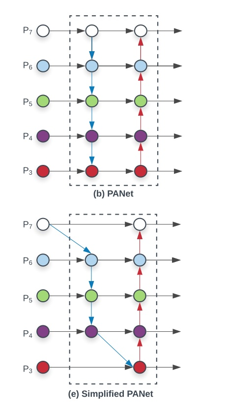
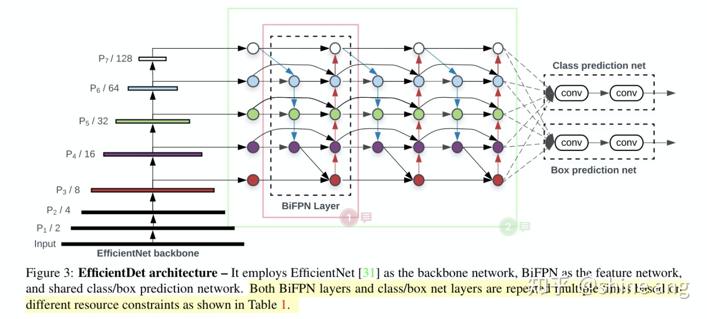
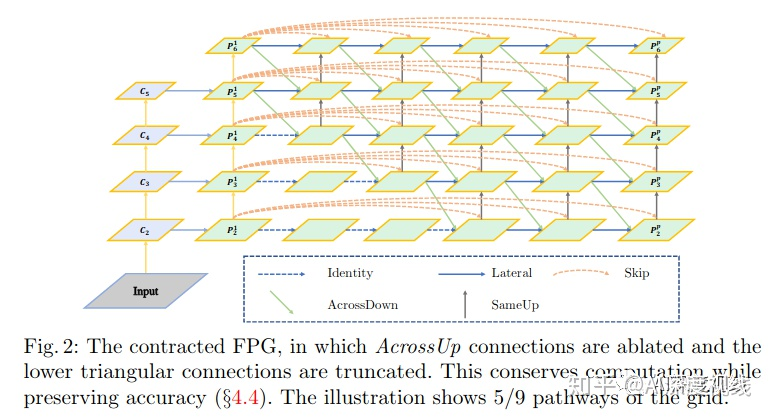

[Bag of Tricks for Image Classification with CNN](https://zhuanlan.zhihu.com/p/53324148)    
[目标检测任务的优化策略tricks](https://zhuanlan.zhihu.com/p/56792817)    

一、数据增强方式
    random erase
    CutOut
    MixUp
    CutMix
    色彩、对比度增强
    旋转、裁剪

解决数据不均衡：
    Focal loss
    hard negative example mining
    OHEMS-OHEM
    GHM（较大关注easy和正常hard样本，较少关注outliners）
    PISA

二、常用backbone

    VGG
    ResNet（ResNet18，50，100）
    ResNeXt
    DenseNet
    SqueezeNet 
    Darknet（Darknet19,53）
    MobileNet
    ShuffleNet
    DetNet 
    DetNAS
    SpineNet
    EfficientNet（EfficientNet-B0/B7）
    CSPResNeXt50
    CSPDarknet53

三、常用Head

Dense Prediction (one-stage):

    RPN
    SSD
    YOLO
    RetinaNet
    (anchor based)
    CornerNet 
    CenterNet
    MatrixNet
    FCOS(anchor free)

Sparse Prediction (two-stage):

    Faster R-CNN
    R-FCN
    Mask RCNN (anchor based)
    ◦RepPoints(anchor free)

四、常用neck

Additional blocks:

    SPP
    ASPP
    RFB
    SAM

Path-aggregation blocks:

    FPN
    PAN 
    NAS-FPN
    Fully-connected 
    FPN
    BiFPN
    ASFF
    SFAM 
    NAS-FPN

五、Skip-connections

    Residual connections
    Weighted residual connections
    Multi-input weighted residual connections
    Cross stage partial connections (CSP)

六、常用激活函数和loss

激活函数：
    ReLU 
    LReLU 
    PReLU
    ReLU6
    Scaled Exponential Linear Unit (SELU)
    Swish
    hard-Swish
    Mish

loss：
    MSES
    mooth L1
    IoU
    GIoU
    CIoU
    DIoU

七、正则化和BN方式

正则化：
    DropOut
    DropPathSpatial 
    DropOutDropBlock

BN：
    Batch Normalization (BN) 
    Cross-GPU Batch Normalization (CGBN or SyncBN)
    Filter Response Normalization (FRN)
    Cross-Iteration Batch Normalization (CBN)

八、训练技巧

    Label Smoothing
    Warm Up

## FPN

### FPN设计思路

在语义分割算法U-Net，以及人体姿态估计Hourglass Networks，都有不同分辨率特征融合，既Encode-Decode。准确来说FPN不是第一个不同层特征融合的网络，但是第一个在目标检测使用多尺度特征融合的方法。

CNN的设计中，网络的深度和down sample是一对矛盾体。网络较为浅，特征提取不充分。网络较深，可以提取较大感受野，随之down sample过大，小目标的检测性能显著降低，同时由于CNN的平移不变形，丢失位置信息。

而对于卷积神经网络而言，不同深度对应着不同层次的语义特征，浅层网络分辨率高，学的更多是细节特征，深层网络分辨率低，学的更多是语义特征。

在FPN之前，存在图 1(a)(b)(c)等特征处理方式。图 1(a) featurized image pyramids 使用多尺度训练和测试方式，既对在不同scale图像提取不同层次特征。One-stage SSD采用图 1(c)Pyramidal feature hierarchy，既分层特征预测目标，让不同level特征学习同样的语义信息。

FPN提出一种不同分辨率特征融合的方式，既每个分辨率的feature map

和上采样的低分辨率特征element-wise相加，使得不同层次的特征增强。由于此方式只在网络基础上做跨层连接和element-wise相加，增加计算量较少，同时性能改善卓越，已经成为目标检测领域的标配。

FPN包括bottom-up pathway、Top-down pathway 和lateral connections三部分。

bottom-up pathway：计算分层级计算不同分辨率特征。论文采用ResNet作为backbone，提取{C1,C2,C3,C4,C5}5个分层特征，只取{C2,C3,C4,C5}四个stage构成特征金字塔，相对于图像的分辨率下采样为{4,8,16,32}。由于C1占用内存较大，故移除。

Top-down pathway：从C5开始，通过最近邻方法把特征图上采样2倍得到C5’，C4通过1*1卷积调整通道数得到C4’， C5’和C4’分辨率相同，可以直接逐元素相加。如此迭代实现C3,C2的特征融合。Top-down逐步增强小目标信息。

lateral connection：得到每个相加的特征图，论文再次用3*3的卷积处理，得到最后的特征图{P2,P3,P4,P5}。

ROIpooling选择：不同尺度的ROI，使用不同特征层作为ROI pooling层的输入，大尺度ROI可选择 P5层；小尺度ROI的特征层可以选择P4。那怎么判断ROI改用那个层的输出呢？

224*224是ImageNet的标准输入，k0是基准值，设置为5，代表P5层的输出（原图大小就用P5层），w和h是ROI区域的长和宽，image_area是输入图片面积，roi_level既为选择的ROI层。
PANet

PANet是由香港中文大学和腾讯优图联合提出的实例分割框架。模型不是直接实现目标检测，但是论文的核心内容是增强FPN的多尺度融合信息。PANet 在 COCO 2017 挑战赛的实例分割任务中取得了第一名，在目标检测任务中取得了第二名。

FPN的低层次的特征（C5）对应大型目标，而高层级特征与低层级别特征之间路径较长（如图 2a所示红色虚线），增加访问准确定位信息的难度。为了缩短信息路径和用低层级的准确定位信息增强特征金字塔，PANet在FPN基础上创建了自下而上的路径增强(图 2b)。用于缩短信息路径，利用low-level 特征中存储的精确定位信号，提升特征金字塔架构。

PANet创建自适应特征池化(Adaptive feature pooling)( 图 2c)。用于恢复每个候选区域和所有特征层次之间被破坏的信息路径，聚合每个特征层次上的每个候选区域。

PANet的目标检测和实例分割共享网络架构的图 2 abc三部分，使得两者性能均有提升。

### FPN结构改进

###  Libra R-CNN
Sample level imbalance:在目标检测的训练过程中，hard samples更有利于提升目标检测的性能，然而，基于随机采样机制造成的结果一般是使挑选的样本趋向于easy类型,harde mining算法如OHEM可以更多的关注hard samples。然而，这些方法对噪声标签比较敏感，容易造成大量的内存及计算量的消耗。Focal Loss应用于单阶段的效果较好，但是，扩展到大部分样本为简单负样本的双阶段检测模型中，效果一般。

    Feature level imbalance:在backbone中深层具有更多的语义信息，而较低层为更多的内容描述等细节信息。FPN及PANet等通过侧连接来进行特征融合，因此，低层特征与高层特征可以对目标检测进行补充。结合金字塔的特征表示利用这些特征的方法决定着目标检测的性能。本文认为，融合的信息应该包含每个分辨率的平衡信息。但上述方法使得融合的特征更多关注于相邻的分辨率而不是其他分辨率。在信息传递过程中，每次融合操作，会使得非相邻层级的语义信息变得稀释。

    Objective level imbalance:检测器包含分类及定位两个任务。因此，在训练目标函数中结合两个不同的目标。如果二者不是平衡的，一个目标可能会被限制，进而导致整体不好的效果。此情形同样适用于训练过程中的样本，如果不平衡，由简单样本产生的小梯度值会淹没hard样本产生的较大的梯度值，进而限制了后续的一些强化操作。因此，针对最优收敛，本文平衡了相关的任务及样本。

    为解决上述问题，提出了简单有效的Libra R-CNN框架。三点创新如下：

(a)IoU-balanced sampling:根据assigned ground-truth进行mine hard samples

(b)balanced feature pyramid:利用相同深度融合的平衡后的语义特征增强多层次的特征。

(c)balanced L1 loss：增强重要的梯度，进而对分类，粗定位，细定位进行再平衡。

为了提高hard negatives选中的概率。根据IoU的值将采样区间划分为K个格子。N要求负样本是在每个格子区间中是均匀分布的，然后对其进行均匀采样。
balanced L1 loss由传统的smooth L1损失演化而来，Smooth L1损失通过设置一个拐点来分类inliers与outliers，并对outliers通过一个max(p,1.0)进行梯度截断。
 balanced L1 loss的关键思想是，促进影响较大的回归梯度，（像来自inliers即准确样本的梯度）。进而平衡包含的样本及任务。从而可以在分类，粗定位，及细定位中进行平衡的训练。，基于balanced L1 loss的定位损失如下，